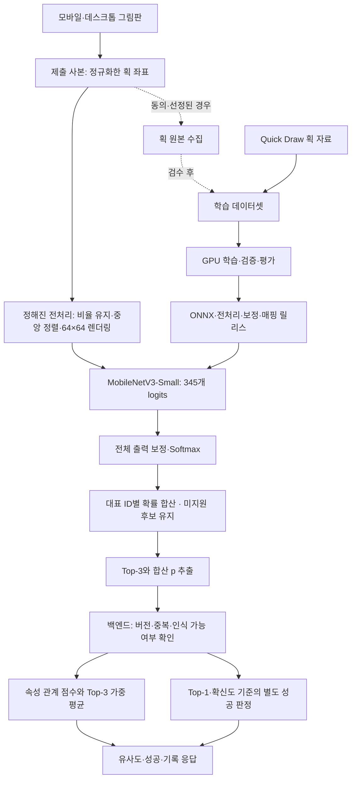

# 그림 인식 모델 구조 v1

기준: [서비스 기획서](<../AI 스케치 게임 서비스 기획서 v3.2.md>), [서비스 아키텍처](service-architecture-v1.md), [프론트 계획](frontend-plan-v1.md), [핵심 파일 계획](core-file-plan-v1.md). 작성일: 2026-09-22.

학습용 GPU에 접근할 수 있다는 조건으로 작성한 설계다. 아직 모델 학습·ONNX 변환·모바일 성능 측정을 실행하지 않았다. 아래 모델·규격·수치는 구현과 비교 실험의 기준안이며 측정된 성능이 아니다.

## 1. 권장 결정

**원본은 정규화한 획 좌표로 보관하고, 첫 배포 후보는 64×64 단색 그림을 입력받는 MobileNetV3-Small로 둔다. Quick, Draw! 공식 분류 예제를 참고한 Conv1D + BiLSTM을 같은 데이터로 비교한다.**

좌표를 보관·전송하는 방식과 신경망의 입력 형식은 별개다. 좌표를 작은 이미지로 렌더링하면 이미지 분류 모델에, 순서와 획 경계를 수치로 표현하면 시퀀스 모델에 넣을 수 있다. 어느 모델을 선택해도 프론트의 원본 그림 규격과 서버에 보내는 Top-3 계약을 유지한다.

| 결정 | 기준안 |
|---|---|
| 학습 프레임워크 | PyTorch. 버전은 구현 시 ONNX 변환·실행 조합을 확인한 뒤 고정 |
| 빠른 기준선 | 기존 28×28 자료를 쓰는 작은 CNN |
| 첫 배포 후보 | 단색 입력·345개 출력으로 수정한 MobileNetV3-Small, 64×64 |
| 공식 레퍼런스 비교군 | 획 순서를 읽는 Conv1D + 양방향 LSTM 분류기 |
| 실행 위치 | 브라우저 ONNX Runtime Web/WASM 우선, 제출 시 한 번 실행 |
| 모바일 대안 | 브라우저 기준 미달 시 서버 ONNX 추론. 아래 전환 조건 적용 |
| 모델의 책임 | 그림이 어떤 카테고리인지 분류 |
| 서버의 책임 | 인식 보류·속성 유사도·성공 판정 |

강한 GPU는 더 많은 데이터·모델 비교·학습 반복에 활용한다. GPU 학습 성능이 휴대폰의 추론 성능을 뜻하지는 않는다. 초기에는 모델 하나를 선택해 배포하고 여러 모델의 동시 실행이나 대형 생성 모델을 필수로 두지 않는다.

## 2. 레퍼런스에서 확인한 사실

| 공식 자료 | 확인한 내용 | 우리 설계에 반영 |
|---|---|---|
| [TensorFlow Quick Draw 분류 튜토리얼](https://github.com/tensorflow/docs/blob/master/site/en/r1/tutorials/sequences/recurrent_quickdraw.md) | 획 좌표 시퀀스를 Conv1D·BiLSTM으로 처리하는 분류 예제 | 좌표 기반 비교 모델의 구조적 기준 |
| [Quick Draw 데이터셋](https://github.com/googlecreativelab/quickdraw-dataset) | 획 자료, 단순화된 좌표, 28×28 이미지 제공. simplified는 시간 정보를 제거하고 비율을 유지해 0~255에 배치 | 원본 획 보존, 시간·필압을 필수 입력으로 삼지 않음 |
| [Google Research의 데이터 설명](https://research.google/blog/introducing-the-kaggle-quick-draw-doodle-recognition-challenge/) | 미완성 그림과 잘못된 라벨이 섞일 수 있음. 획 순서·방향이 추가 정보가 될 수 있음 | 시퀀스 모델 비교, 노이즈 검토, 실제 서비스 그림 평가 |
| [Magenta Sketch-RNN](https://magenta.tensorflow.org/sketch_rnn) | 벡터 그림 생성 모델 | 이번 분류 모델과 구분 |

공식 튜토리얼은 과거 TensorFlow 1 계열 예제다. 현재 Quick, Draw! 운영 모델의 정확한 가중치·레이어·성능이 공개됐다는 근거로 쓰지 않는다. 알고리즘을 참고하고 현재 프로젝트의 학습·내보내기 환경으로 구현한다.

MobileNetV3는 모바일 CPU를 고려한 모델 계열이다. 다만 논문의 모바일 성능을 우리 브라우저 성능으로 대입할 수 없다. 1채널·64×64·345개 출력은 우리의 변경안이며 공식 ImageNet 성능 수치를 그대로 적용하지 않는다. [MobileNetV3 논문](https://arxiv.org/abs/1905.02244), [Torchvision 구현](https://docs.pytorch.org/vision/stable/models/generated/torchvision.models.mobilenet_v3_small.html)

## 3. 전체 흐름



그림 인식 모델에는 오늘의 정답, 숨겨진 속성, 유사도 점수를 입력하지 않는다. 분류 결과에서 속성 점수로 연결하는 책임은 서버에 있다. 분류 모델의 내부 특징 벡터를 기획서의 속성 벡터 대신 사용하지 않는다.

## 4. 그림 원본과 모델 입력

### 4.1 공통 원본: 획 좌표

프론트 원본 규격의 기준안은 다음과 같다. 실제 JSON Schema는 후속 구현에서 작성한다.

```json
{
  "drawingVersion": "strokes-v1",
  "coordinateMax": 1024,
  "brushVersion": "pen-v1",
  "strokes": [
    [[100, 200], [110, 210], [125, 220]],
    [[500, 400], [520, 420]]
  ]
}
```

- 정사각형 그리기 영역의 좌상단을 원점으로 하고 오른쪽이 +x, 아래쪽이 +y다. 실제 CSS 그리기 영역을 0~1로 정규화한 뒤 0~1024 정수로 양자화한다. 디바이스 픽셀 비율은 저장 좌표에 곱하지 않는다.
- 획 경계와 점의 순서를 보존한다. 단일 점으로 찍은 획도 보존한다. 시간·필압은 초기 모델의 필수 입력에서 제외한다.
- 선 굵기·색·끝 모양은 `brushVersion`으로 고정한다. 화면 픽셀 단위의 펜 굵기를 그대로 학습에 사용하지 않는다.
- 정해진 점 정리 절차를 적용한 동일 제출 사본으로 추론·해시·썸네일·수집을 연결한다. 전송할 때만 다른 그림으로 줄이지 않는다.
- 해시는 필드 순서·정수 표기·버전을 고정한 직렬화 결과로 만든다. 기기 해상도·렌더링한 PNG 바이트를 원본 그림의 동일성 기준으로 삼지 않는다.

64획·획당 1,024점·전체 4,096점·그림 JSON 64KiB를 용량 제한의 초기 후보로 유지한다. 아직 서비스 규칙으로 확정하지 않았다. 서버도 바이트 수·배열 길이·좌표 범위를 검증하며 제한 초과 데이터를 조용히 잘라내지 않는다. 빈 그림은 모델 실행 전에 걸러낸다.

### 4.2 두 종류의 정규화

1. **화면 좌표 정규화:** 같은 위치를 어떤 화면에서도 동일하게 저장한다. 캔버스 내부의 위치와 여백은 보존한다.
2. **모델용 정규화:** 그림 전체의 경계 상자를 기준으로 종횡비를 유지해 크기와 위치를 맞춘다. x와 y를 각각 강제로 늘려 사물 비율을 바꾸지 않는다.

Quick Draw simplified는 이미 이동·비율 정규화와 간소화가 적용된 자료다. 공식 간소화는 1px 간격 재표본화와 epsilon 2.0의 RDP를 사용한다. 새 사용자 획에도 이에 대응하는 처리를 시험하되, 기존 simplified에 같은 간소화를 무조건 반복하지 않는다. 전처리 버전에 입력 출처별 어댑터와 적용 여부를 기록한다. [공식 전처리 설명](https://github.com/googlecreativelab/quickdraw-dataset#preprocessed-dataset)

### 4.3 첫 배포 후보의 신경망 입력

| 항목 | 기준안 |
|---|---|
| 입력 이름 | `image` |
| 타입·축 | `float32`, NCHW |
| 학습 입력 | `[B, 1, 64, 64]` |
| 브라우저 입력 | `[1, 1, 64, 64]` |
| 픽셀 | 배경 0, 선 1, 중간값은 안티앨리어싱 |
| 정규화 | uint8 렌더 결과를 255로 나누기. ImageNet RGB 평균·표준편차는 사용하지 않음 |
| 전처리 버전 후보 | `qd-strokes-64-v1` |

64px 렌더러의 첫 실험안은 최장 좌표 범위 48px, 중심 31.5, 둥근 선 굵기 4px다. 4배 해상도에서 렌더하고 정해진 면적 평균으로 축소하는 공통 규칙을 구현한다. 최종 선 굵기·간소화 허용 오차는 실제 그림 평가 후 버전으로 고정한다. 단일 점·일직선·매우 작은 그림의 처리와 입력 불충분 판단도 fixture에 포함한다.

기존 `qd-strokes-28-v1`은 최장 범위 20px, 중심 13.5, 선 굵기 1.75px, PIL 기반 렌더·Lanczos 축소다. **64px 입력은 기존 28px 이미지를 확대해서 만들지 않고 획 자료에서 새로 렌더한다.** 기존 이미지와 버전은 보존하고 신규 산출물은 `data/datasets/{datasetVersion}` 아래에 둔다.

Python·브라우저에서 같은 그림이 같은 모델 입력이 되는지 픽셀 차이·Top-3·확신도·판정 경계로 확인한다. PIL과 Canvas의 기본 선 그리기가 동일하다고 가정하지 않는다. 공통 규칙 구현의 재현성이 확보되기 전에는 모델 성능을 운영 성능으로 확정하지 않는다.

## 5. 비교할 모델 세 개

### A. 작은 CNN: 연결과 회귀 검사용

`1×28×28 → Conv(32) → Conv(64) → Conv(128) → 전역 평균 풀링 → Linear(345)`를 기본으로 하고 중간 ReLU·정규화·다운샘플링을 둔다. 기존 자료로 데이터·출력 매핑·내보내기가 연결되는지 먼저 확인한다. 이 모델만으로 인식 품질이 충분하다고 가정하지 않는다.

### B. MobileNetV3-Small: 우선 배포 후보

```text
1×64×64
 → 단색 입력용 첫 Conv
 → MobileNetV3-Small 특징 추출 블록
 → 전역 평균 풀링
 → 분류 헤드
 → 345개 logits
```

첫 Conv의 입력 채널을 1로, 마지막 Linear의 출력을 345로 변경하고 `weights=None`으로 Quick Draw에서 학습하는 것을 기본으로 한다. ImageNet 사전학습을 시험할 경우 채널 변환·입력 정규화·가중치 초기화를 별도 실험으로 명시한다. 공식 3채널 모델 가중치를 수정한 구조에 그대로 넣지 않는다.

선택 이유는 제출된 그림의 전체 형태를 처리하고 고정 크기 입력으로 브라우저 실행을 구성하기 쉽기 때문이다. 좌표의 원래 획 순서 정보는 활용하지 못한다. 이 손실이 실제 인식에 중요한지는 C와 비교한다. 작은 입력에서 지나친 다운샘플링이 세부 특징을 잃는지도 96px 후보와 비교하되 처음부터 여러 해상도를 운영하지 않는다.

### C. Conv1D + BiLSTM: Quick Draw 기반 비교 모델

공식 예제를 바탕으로 한 프로젝트용 구조안이다. 공식 모델의 정확한 복제라고 부르지 않는다.

```text
정규화한 좌표 시퀀스 [B, L, 5] + 유효 길이
 → Conv1D 64, kernel 5
 → Conv1D 128, kernel 5
 → BiLSTM, 방향별 hidden 128, 2개 층
 → 유효 위치만 평균 풀링
 → Linear(256, 345)
 → 345개 logits
```

5개 입력 특징은 `[x, y, dx, dy, strokeStart]`다. x·y는 그림 경계 기준으로 비율을 유지해 정규화한다. 획의 첫 점은 `strokeStart=1`, `dx=dy=0`으로 두고 획 사이 이동을 실제 선처럼 연결하지 않는다. 각 획의 절대 위치는 x·y로 유지한다. 이는 공식 예제의 3채널 표현과 구분되는 자체 설계다.

첫 길이 후보는 `L=512`다. 짧은 그림은 padding하고 유효 길이를 별도로 전달한다. Conv의 padding, 역방향 LSTM, 풀링에서 padding이 실제 점으로 처리되지 않도록 길이를 반영한다. ONNX에서도 길이별 결과가 PyTorch와 일치하는지 확인한다.

512점 초과 그림은 뒤를 자르지 않는다. 획 경계·끝점·형태를 보존하는 단순화를 시험하고, 허용 오차 안에서 줄이지 못하면 명시적으로 보류한다. 학습 제외·보류 비율을 보고한다. 해당 비율이 크면 길이를 늘리거나 이미지 모델을 선택한다. 원본 좌표는 모델의 길이 제한에 맞춰 덮어쓰지 않는다.

획 순서 모델이 실측 품질과 모바일 기준을 모두 만족하면 B 대신 C를 단독 배포할 수 있다. 양방향 모델도 제출된 전체 그림을 받으므로 현재 게임 흐름과 맞는다. 매 획 실시간 추론은 이번 범위에 추가하지 않는다.

## 6. 모델 출력과 API 정보

### 6.1 모델 자체 출력

세 모델 모두 `logits: float32[B, 345]`를 출력한다. 출력 인덱스는 기존 `labels.json`의 클래스 매핑에 연결하고 임의로 이름순 재정렬하지 않는다. 모델 입력 종류·축·클래스 매핑 해시를 manifest에 기록한다.

`logits`는 합이 1인 확률이 아니다. 런타임이 **345개 전체 출력에** `rawP = softmax(logits / T)`를 한 번 적용한다. `T>0`는 보정 데이터로 학습한 값이며 초기 미보정 비교에서는 1이다. 이어서 [카테고리 매핑](catalog-curation-v1.md)에 따라 `p[serviceId] = sum(rawP[해당 원본들])`을 계산하고 Top-3를 뽑는다. 미지원 `bird`도 그대로 남기며 합산 후 재정규화하지 않는다. ONNX 내부에는 Softmax와 보정을 넣지 않는 기준으로 위치를 명확히 한다. [Temperature scaling 연구](https://proceedings.mlr.press/v70/guo17a.html)

이 문서의 **원래 p**는 전체 345개 확률 질량을 보존한 후보별 합산 값이다. 현재 매핑 초안은 335개 인식 후보(점수 지원 초안 334개 + 미지원 `bird`)를 만든다. 같은 p이면 소속 원본 `class_index`의 최솟값 순으로 정렬한다. 원본 출력 순서·매핑·후보 순서·매핑 해시를 릴리스에 고정하고, 모델별 T와 인식 임계값·보정 품질은 매핑 적용 후에도 평가한다. 출력이 345개라고 임의의 낙서나 미지원 사물을 확실히 식별할 수 있는 것은 아니다.

### 6.2 백엔드 제출 예시

`POST /api/puzzles/{puzzleId}/submissions`의 개념 예시다. ID·버전명·점수는 설명용이다.

```json
{
  "submissionId": "00000000-0000-4000-8000-000000000001",
  "drawingHash": "aaaaaaaaaaaaaaaaaaaaaaaaaaaaaaaaaaaaaaaaaaaaaaaaaaaaaaaaaaaaaaaa",
  "releaseId": "release-example",
  "modelVersion": "mobilenet64-example",
  "preprocessingVersion": "qd-strokes-64-v1",
  "catalogVersion": "catalog-curation-v1.1",
  "outputCalibrationVersion": "temperature-example",
  "drawingVersion": "strokes-v1",
  "brushVersion": "pen-v1",
  "top3": [
    {"categoryId": "cat", "p": 0.62},
    {"categoryId": "tiger", "p": 0.17},
    {"categoryId": "dog", "p": 0.08}
  ],
  "collectionConsentRevision": 0
}
```

이 예시의 Top-3 합은 0.87이며 나머지 클래스에 0.13이 남아 있다. 서버는 이 원래 p로 보류·성공 기준을 적용하고, 유사도 합산 때만 `q_i=p_i/Σtop3(p)`를 계산한다. 입력 ID의 유효성·중복·정렬·유한한 점수·합·버전도 검사한다. 이 검사만으로 클라이언트가 실제 추론을 실행했음을 증명할 수는 없다.

원본 출력 클래스 345개, 매핑 후 후보 335개, 점수 지원 초안 334개, 데일리 정답 후보 323개를 구분한다. Top-3 추출 전에 미지원 후보를 지우거나 재정규화하지 않는다. Top-3에 미지원 후보가 있으면 `deferred/unsupported_candidate`로 보류한다. 실제 출시 지원 범위는 검수와 인식 평가를 통과한 부분집합으로 별도 승인한다.

브라우저 추론에서는 그림 원본을 매 판정 요청에 포함하지 않는다. 동의·선정된 제출의 획 좌표는 별도 수집 경로로 전송한다. 서버 추론 전환 시의 예외는 9절을 따른다.

## 7. 데이터와 GPU 학습

### 7.1 현재 데이터와 입력 길이 실측

저장소에는 345개 클래스 × 1,000개, 총 345,000개의 simplified 획 자료와 프로젝트가 렌더한 28px 이미지가 있다. 파일 앞부분의 표본이므로 무작위 대표 표본은 아니다.

2026-09-22 로컬 simplified 345,000개를 전수 읽어 측정했다. 아래 점 수는 이미 단순화된 데이터의 통계이며 브라우저 입력 이벤트 수가 아니다.

| 지표 | 중앙값 | 95백분위 | 99백분위 | 최댓값 |
|---|---:|---:|---:|---:|
| 그림당 획 수 | 4 | 13 | 20 | 366 |
| 그림당 전체 점 수 | 39 | 91 | 141 | 1,309 |
| 그림에서 가장 긴 획의 점 수 | 17 | 41 | 81 | 1,275 |

64획 초과는 19개, 전체 256점 초과는 499개, 512점 초과는 34개였다. 4,096점 초과는 없었다. 따라서 512점 시퀀스는 시작 후보로 타당하지만, 실제 사용자가 그린 그림에서도 충분한지는 별도로 측정해야 한다. 64획 제한은 낙서를 포함한 일부 기존 자료를 제외하므로 클래스별 제외 비율도 확인한다.

### 7.2 데이터 구성

1. 현재 표본으로 A/B/C의 연결과 학습을 검증한다.
2. 본 학습은 원본 출처에서 클래스별로 재현 가능한 무작위 표본을 구성한다. 1차 확장 목표는 클래스당 10,000개 내외로 잡고 학습 곡선·저장 공간에 따라 늘린다. 앞에서부터 10,000개를 자르는 방식을 무작위 추출이라고 부르지 않는다.
3. 원본 key_id·획 해시·렌더 이미지 해시·출처·전처리 버전을 manifest에 남긴다. 사용자 수집 자료에는 검수 라벨·동의 상태·세션도 연결한다.
4. 동일 원본, 동일 이미지 및 확인된 유사 그림 그룹을 같은 split에 둔다. 수집 그림의 연속 수정본은 사용자/세션 그룹으로 묶는다. Quick Draw에 사용자 ID가 없으면 사용자 단위 독립성을 보장했다고 보고하지 않는다.

기존 train/validation/test 분할은 28px 이미지 해시 기준이다. 64px로 바꿀 때 모델마다 새 해시로 제각각 split을 뽑지 않는다. 기존 분할을 출발점으로 삼고 중복 그룹 충돌을 점검해 새 manifest에서 한 번 정리한 뒤 모든 모델이 같은 원본 ID 분할을 사용한다. 데이터 확장 때도 테스트와 중복되지 않게 감사한다.

`recognized`는 당시 Google 게임이 인식했는지 나타내는 값이다. 정답 라벨이 사람이 검수됐다는 뜻이 아니다. 전체 유효 자료 학습을 기준으로 `recognized=true`만 사용한 실험을 비교하고, false를 무조건 오답이나 unknown 클래스로 바꾸지 않는다. 실제 서비스에서는 사람이 그림의 대상을 확인한 별도 평가셋을 마련한다.

### 7.3 학습·보정·선택

초기 공통 설정 후보는 CrossEntropy, AdamW, 학습률 0.001, weight decay 0.0001, 최대 50 epoch와 검증 손실 기반 조기 종료다. 배치 크기는 256부터 GPU 메모리에 맞춰 조정한다. 자동 혼합 정밀도는 검증한 GPU에서 사용하고 시드·라이브러리·데이터 버전·설정을 남긴다. 이 값들은 최적값이 아니라 비교 실험의 시작점이다.

획 좌표에서 작은 회전·이동·스케일 변화와 렌더 선 굵기 변화를 시험한다. 대상을 잘라내는 crop, 무조건적인 상하 반전, 의미를 없애는 강한 획 삭제는 기본 증강으로 쓰지 않는다. 미완성 그림을 무조건 원래 카테고리의 확실한 정답으로 학습시키지 않는다.

기존 validation을 그룹 기준으로 모델 선택용과 보정용으로 나눠 고정한다. 보정용 자료 안에서도 T 추정과 인식/성공 임계값 조정의 사용 내역을 기록한다. 최종 테스트는 모델·임계값 선택에 반복 사용하지 않는다. 테스트 결과를 보고 다시 튜닝한 경우 새로운 독립 최종 평가가 필요하다.

GPU 여유는 데이터 확대와 복수 시드 비교에 우선 사용한다. 더 큰 교사 모델에서 작은 모델로 지식을 전달하는 학습은 정확도 병목이 확인된 뒤의 확장안이다. 초기 배포 요건에 대형 모델·앙상블·지식 증류를 모두 추가하지 않는다.

## 8. 무엇을 평가해야 하나

| 평가 | 의미 |
|---|---|
| Top-1 / Top-3 정확도 | 전체와 클래스별 인식, 후보 3개 안에 정답이 포함되는지 |
| 클래스별 재현율·혼동 행렬 | cup/mug, cat/tiger 등 구분 가능성과 데일리 정답 적합성 |
| 보정 | 검증·실서비스 표본의 NLL/ECE 등으로 p와 실제 정답률의 차이 확인 |
| 잘못된 성공 | 특정 문제의 정답이 아닌 검수 그림 중 서버가 성공으로 처리한 비율. 분모와 표본 수 명시 |
| 보류와 처리 범위 | 전체 중 점수를 제공하는 비율과 그 안의 인식 오류를 함께 보고 |
| 미지원·낙서 | 빈 그림·점·직선·임의 낙서·지원 밖 대상의 잘못된 고확신 인식 |
| 기기·표현 변화 | 터치/마우스, 선 굵기, 원본 크기, 수정 전후 Top-3·점수 안정성 |
| 실제 실행 | 모델 다운로드 크기, 초기화, 전처리, 추론 p50/p95, 메모리·UI 멈춤 |

빈 그림 검사는 규칙으로 가능하지만 Softmax 최고값 하나만으로 모든 미지원 그림을 거부할 수는 없다. `p1`, `p1-p2`, Top-3 합을 후보 기준으로 평가하고 실제 미지원 그림으로 실패율을 측정한다. 온도 보정도 미지원 판별기를 대신하지 않는다. 필요하면 추후 별도 판별기를 검토하되 지금 346번째 `unknown` 클래스를 임의로 만들지 않는다.

유사도 계산에 사용하는 속성 데이터의 완성도도 별도로 평가한다. 분류 정확도가 높아졌다고 속성 점수와 게임 재미가 자동으로 개선되는 것은 아니다. 현재 속성 v3 345개는 모두 미검수이므로 모델 학습 완료와 운영 점수표 준비 완료를 구분한다.

## 9. 모바일 가능 여부와 배포 기준

**모바일은 구조적으로 가능하다. 브라우저에서 선택 모델을 원활히 실행할 수 있는지는 아직 미검증이다.** ONNX Runtime Web은 WASM 실행을 제공하고, GPU 실행 경로는 연산자·환경별 지원 범위가 다르므로 실제 내보낸 모델로 확인해야 한다. [ONNX Runtime Web 공식 안내](https://onnxruntime.ai/docs/tutorials/web/)

초기에는 FP32 ONNX, 배치 1, WASM을 기준으로 비교한다. WebGPU를 필수로 두지 않는다. 모바일에서 FP16이나 INT8이 무조건 더 빠르다고 가정하지 않으며 양자화는 정확도·보정·실행 성능을 재평가한 별도 artifact로 취급한다.

다음은 첫 실기기 검증 목표이며 보장치가 아니다.

- 배포 모델 파일 10MiB 이내를 목표로 한다. 실제 수정 모델의 크기를 내보낸 뒤 기록하며 런타임 파일 크기는 별도로 합산한다.
- 준비된 모델에서 전처리+추론 p95 500ms 이내를 목표로 한다. 다운로드·모델 초기화·API 왕복 시간은 따로 측정한다.
- iOS Safari, Android Chrome, 데스크톱 브라우저에서 고정된 그림 표본을 반복 실행한다. 대상 중저가 기기·OS·브라우저 버전을 기록한다.
- 모델을 한 번 로드해 재사용하고 Worker에서 실행해 UI 영향을 확인한다. 장시간 사용·화면 회전·백그라운드 복귀 시 메모리 오류도 확인한다.
- 인식 기준을 만족해도 모바일이 자주 멈추거나 추론 예산을 넘으면 브라우저 배포 후보에서 제외한다. 느린 기기 결과를 데스크톱 평균으로 숨기지 않는다.

### 브라우저 실행이 기준을 못 맞출 때

같은 획 좌표를 FastAPI에 보내 서버에서 전처리·ONNX 추론을 수행할 수 있다. 작은 모델은 서버 CPU부터 측정하고 동시 요청량에 따라 운영 GPU를 검토한다. **학습용 GPU 접근권한이 상시 운영 서버 사용권한을 뜻하지는 않는다.**

이 전환은 모델 입력만 바꾸는 작업으로 끝나지 않는다. 공개 릴리스에 `inferenceLocation`을 명시하고 서버 추론용 요청에는 좌표를 포함한다. 서버가 만든 Top-3만 판정에 사용하며 클라이언트 결과를 신뢰하지 않는다. 타임아웃·중복 처리·요청 크기·동시 처리량을 API 설계에 반영한다.

서버 추론에서는 비동의 사용자의 그림도 판정을 위해 일시 전송되므로, 학습용 보관 동의와 별개로 전송 사실을 안내해야 한다. 비동의 원본은 학습 저장소나 요청 본문 로그에 남기지 않는 처리 원칙을 정한다. 네트워크 지연과 서버 비용이 새로 생긴다.

초기 릴리스는 실행 위치 하나로 고정한다. 기기별 자동 전환은 양쪽 전처리·결과 동등성과 서버 운영 준비가 끝난 뒤 검토한다. 모바일 브라우저 모델이 실패해도 모바일 웹 서비스 전체가 불가능해지는 것은 아니다.

## 10. 산출물과 기존 파일 책임

새 소스 폴더를 만들지 않는다. 한 비교 실험마다 다음 산출물을 버전별로 남긴다.

| 산출물 | 위치·용도 |
|---|---|
| 데이터 manifest·입력 캐시 | `data/datasets/{datasetVersion}`: 원본 ID·split·출처·전처리 |
| 학습 가중치·설정·이력 | `data/artifacts/models/{modelVersion}` |
| 평가·보정 결과 | 같은 모델 버전 안에 클래스별 평가, T, 인식 임계값 후보, 기기 측정 |
| ONNX·클래스 매핑·manifest | 모델 버전에 고정. 파일 해시·입출력·전처리·보정 위치·런타임 조합 포함 |
| 최종 서비스 릴리스 | `data/artifacts/releases/{releaseVersion}`: 모델·점수표·성공 조건 결합 |

| 기존 계획 파일 (`model/` 기준) | 이번에 구체화한 책임 |
|---|---|
| `datasets/build_manifest.py` | 동일 원본 분할, 데이터 확대 표본, 검수·동의·중복 그룹, 길이 분포 기록 |
| `datasets/sketch_dataset.py` | 같은 manifest에서 이미지/시퀀스 입력과 라벨 제공 |
| `datasets/preprocess.py` | 기존 28px 호환, 신규 64px 렌더, 획 정규화·시퀀스 특징과 길이 처리 |
| `networks/sketch_classifier.py` | 설정에 따라 작은 CNN / MobileNetV3-Small / Conv1D-BiLSTM 생성, 공통 logits 출력 |
| `training/train.py` | 공통 학습·체크포인트·재현 설정. 후보별 CLI를 따로 만들지 않음 |
| `evaluation/evaluate.py` | 클래스별 정확도·잘못된 성공·보류·미지원 그림 평가 |
| `evaluation/calibrate.py` | 전체 logits의 온도 보정과 인식/성공 기준 후보 평가 |
| `export/export_onnx.py` | 모델별 입력 이름·축·동적 길이/고정 길이 계약에 맞춰 내보내기 |
| `export/check_onnx.py` | PyTorch/ONNX 수치·Top-3 비교, 길이·빈 입력 경계, 브라우저 fixture |
| `pipelines/run_training.py` | 동일 manifest로 후보 비교 실행과 결과 수집 |
| `pipelines/build_release.py` | 선택 모델·보정·전처리·클래스 매핑·점수표 호환성 검증 |

프론트 `preprocess.ts`, `modelRuntime.ts`, `inference.worker.ts`는 manifest의 입력 종류에 맞춰 동작한다. `contracts/model/model-manifest.schema.json`에 `inputKind`, 입력/출력 명세, 매핑 해시, 보정 위치, 전처리 버전, 실행 위치를 포함할 계획이다. 출력 계약은 같으므로 기록 UI와 서버 속성 점수 모듈은 모델 종류에 따라 다시 만들지 않는다.

## 11. 착수 순서

1. 획 규격·전처리 fixture·클래스 매핑·공통 split 확정.
2. 작은 CNN으로 학습→ONNX→브라우저→Top-3 계약 검증.
3. MobileNetV3-Small과 Conv1D-BiLSTM을 동일 표본에서 비교. 본 학습 전에 모바일 내보내기·짧은 실행 시험으로 구조적 호환성 확인.
4. 재현 가능한 표본 확대와 실제 사용자 그림 평가셋 준비 후 본 학습·보정.
5. 인식 품질·잘못된 성공·모바일 p95로 배포 모델과 실행 위치 선택.
6. 검토된 속성 지원 목록·점수표와 묶어 릴리스. 기준을 통과하지 못하면 운영 완료로 표시하지 않음.

이번 작업은 구조와 데이터 길이 통계 확인까지다. 모델 코드를 생성하거나 GPU 학습, 추가 다운로드, 서버 추론 전환을 실행하지 않았다.
