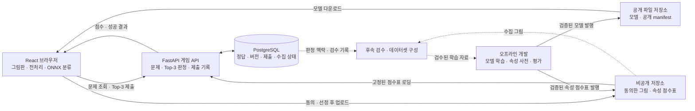

# 싱글 스케치 게임 아키텍처 제안 v1

기준: [기획서 v3.2](<../AI 스케치 게임 서비스 기획서 v3.2.md>). 작성일: 2026-09-22.

이 문서는 구현 전 **제안안**이다. 기획서의 확정 방향을 구현 단위로 구체화하고, 미정인 기술·운영 정책은 권장안으로 구분한다. 코드를 생성하거나 서비스를 배포한 상태는 아니다.

사용자가 아키텍처 검토 기준으로 **React + FastAPI**를 선택했다. TypeScript, PostgreSQL, 파일 저장소 구성과 운영 정책은 아래 제안안을 기준으로 후속 설계한다.

후속 정리: 같은 날 실제 저장소와 대조해 담당별 산출물, 모델·API 연결 규격, 수집 상태, 릴리스 발행 조건과 개발 순서를 보완했다. 아래의 새 디렉터리·API·상태 이름은 설계 제안이며 아직 구현된 기능이 아니다.

구현 세부 기준은 [API 계약](api-contract-v1.md)과 [DB 스키마·트랜잭션](database-schema-v1.md)에 구체화했다. 이 문서는 전체 구조를 요약하며, 정확한 필드·오류·중복 처리·수집 전이는 두 상세 문서를 기준으로 한다. [폴더 구조](folder-structure-v1.md)의 의존성 방향도 함께 적용한다.

## 1. 핵심 구성

초기 구성은 브라우저 앱, 게임 API 하나, 관계형 DB, 파일 저장소다. 모델 학습·속성 생성은 게임 요청 경로 밖의 개발 도구로 둔다. 백엔드는 하나로 배포하되 내부 모듈 경계를 나눈다.

| 구성 | 맡는 일 | 관리하는 데이터 |
|---|---|---|
| 브라우저 앱 | 그림판, 제출 사본, 모델 다운로드·전처리·추론, 결과·기록 표시 | 현재 획, 로컬 썸네일·진행 기록, 모델 캐시 |
| 게임 API | 익명 세션, 오늘의 문제, 제출 접수, 판정 호출, 성공 처리, 수집 접수 | 문제별 정답과 버전, 제출 상태, 수집 권한 |
| 관계형 DB | 중복 방지, 문제·세션·제출의 일관된 저장 | 제출 결과, 판정 당시 버전, 그림 저장 상태, 검수 이력 |
| 공개 파일 배포 | 브라우저 앱·모델·전처리 명세 배포 | 해시가 있는 변경 불가 모델 파일과 공개 manifest |
| 비공개 파일 저장 | 수집에 동의한 그림과 내부 판정 자료 보관 | 복원 가능한 획, 메타데이터, 속성 벡터·점수표 |
| 오프라인 개발 도구 | 학습·평가·ONNX 변환, 속성 사전·벡터 생성, 릴리스 준비 | 데이터셋 manifest, 학습 결과, 평가 보고서 |

**플레이 중 GMS/LLM 호출은 없다.** LLM은 개발 시 속성 사전 초안을 만들 때만 선택적으로 사용한다. 브라우저 분류와 서버의 정해진 점수 계산은 새 LLM 키가 없어도 개발할 수 있다.

점선은 후속 MLOps 경로다. 게임 요청이 모델 학습이나 속성 생성 완료를 기다리는 구조가 아니다.

## 2. 기술 구성 — React + FastAPI 기준

| 영역 | 제안 | 선택 이유·검증 조건 |
|---|---|---|
| 프론트 | React + TypeScript + Vite, Canvas 2D | 단일 게임 화면과 브라우저 모델 실행 중심으로 구성 |
| 브라우저 추론 | ONNX Runtime Web, WASM 우선 | 기획서 후보를 유지. 입력 크기·모델 크기·실제 기기 추론 시간 검증 후 확정 |
| 모델 학습 | PyTorch, GPU에서 후보 비교 | 작은 CNN 기준선, 64px MobileNetV3-Small 우선 후보, 좌표 Conv1D-BiLSTM 비교 |
| 백엔드 | FastAPI | 사용자가 선택한 설계 기준. 현재 Python 데이터·판정 도구를 활용 |
| DB | PostgreSQL | 제출 ID와 세션별 결과를 제약조건·트랜잭션으로 일관되게 관리 |
| 파일 저장 | 객체 저장소, 모델 공개 영역과 그림 비공개 영역 분리 | 모델 배포와 그림 수집의 접근 방식·수명을 다르게 관리 |
| 로컬 실행 | 프론트 개발 서버 + API + DB, Docker Compose 활용 | 팀원의 실행 환경 재현. 파일 저장은 개발용 어댑터 제공 |
| 초기 운영 | 정적 프론트 배포 + API 컨테이너 + DB + 객체 저장소 | 호스팅 업체·요금제·서버 크기는 팀 환경·예산 확인 후 선택 |

ONNX Runtime Web의 WASM 실행·배포 방식은 [공식 배포 문서](https://onnxruntime.ai/docs/tutorials/web/deploy.html)를 따른다. 추론 때문에 UI가 멈추면 Worker로 분리하고 [공식 성능 진단 안내](https://onnxruntime.ai/docs/tutorials/web/performance-diagnosis.html)를 기준으로 측정한다. 처음부터 WebGPU를 필수로 가정하지 않는다.

백엔드 언어가 바뀌어도 아래 데이터 계약과 모듈 경계는 유지한다. 브라우저 추론 구조에서는 Python 추론 서버를 항상 별도로 띄울 필요가 없다. 서버 재추론을 도입할 때 처리량·모델 메모리를 보고 같은 API 내부 또는 별도 서비스로 배치한다.

입출력·데이터 분할·학습·모바일 검증은 [모델 구조](model-architecture-v1.md)에 구체화했다. 모바일 웹은 구조적으로 가능하며 브라우저 추론 성능은 실기기로 확인한다. 기준 미달 시 획 좌표를 보내는 서버 추론을 대안으로 검토하되, API·원본 전송 안내·운영 용량을 함께 변경해야 한다. 학습용 GPU를 상시 운영 자원으로 가정하지 않는다.

## 3. 프론트 모듈

모바일·데스크톱을 초기 지원한다. 그림판 → 제출 기록 → 하단 Q&A의 한 열 화면과 오류·복원 표시 규칙은 [프론트 화면 계획](frontend-plan-v1.md)을 따른다.

| 모듈 | 역할 |
|---|---|
| `drawing` | 획 배열·좌표·펜 설정 관리. Undo는 마지막 획 제거, Reset은 현재 그림만 초기화 |
| `inference` | manifest 검증·모델 로드, 고정된 전처리, 전체 출력 보정·대표 ID별 확률 합산, 미지원 후보를 유지한 Top-3 추출 |
| `game` | 문제 ID·릴리스 고정, 제출 중 상태, 시도 기록, 성공 화면 |
| `storage` | 동일 브라우저의 진행 기록·썸네일·미완료 제출 ID 보관 |
| `collection` | 학습용 보관 선택, 선정된 제출 사본 업로드와 재시도 |
| `api` | 요청·응답 타입, 동일 제출 ID 재시도, 오류 메시지 변환 |

Pen·Undo·Reset은 로컬 편집만 수행한다. 제출할 때 사본을 만들고 추론한다. 편집 중 점수는 마지막 제출 결과임을 표시한다. 썸네일과 복원 가능한 원본 획은 용도를 구분한다.

모델은 로딩 완료 후 사용 가능하게 한다. 모델 URL·파일 해시는 릴리스에 고정한다. 새 배포 후에도 기존 문제를 진행하는 사용자가 해당 모델을 계속 받을 수 있도록 파일을 유지한다. 프론트 캐시는 정답이나 판정 버전의 최종 권한을 갖지 않는다.

## 4. 백엔드 모듈

| 모듈 | 역할 |
|---|---|
| `sessions` | 로그인 없는 익명 세션 발급·만료, 제출 소유권 확인 |
| `puzzles` | 날짜별 문제 조회, 서버에만 정답 보관, 자정 전후 문제 선택 |
| `submissions` | 입력 검사·중복 처리·시도 번호·성공 상태 저장 |
| `judging` | 버전에 맞는 점수 계산과 성공 조건 호출. 그림 수집과 독립 |
| `collections` | 동의·표본 선정·그림 업로드 상태, 저장 실패 재시도 |
| `releases` | 모델·전처리·카테고리·점수·성공 조건 버전 묶음 조회 |

HTTP 요청을 받는 코드에서 판정 수식을 직접 구현하지 않고 `judging` 인터페이스를 호출한다. 현재 태그 벡터와 향후 텍스트 임베딩은 같은 판정 입력·출력 계약 뒤에서 교체한다. 점수 수식과 가중치 자체는 별도 실험 결과로 결정한다.

## 5. 화면 진입과 제출 흐름

1. 서버가 익명 세션을 발급한다. 동일 브라우저에서는 보호된 세션 쿠키를 이용해 자신의 게임 기록에 접근한다.
2. 오늘의 문제를 조회해 문제 ID·공개 릴리스 정보를 받는다. 서버 기준 날짜를 사용하고, 정답은 보내지 않는다.
3. 브라우저가 해당 모델·전처리를 준비한다. 이전 문제를 이어 하는 경우 기존 문제 ID를 유지한다.
4. 제출 사본과 제출 ID를 만들고 로컬 추론을 수행한다. Top-3의 원래 점수와 버전 정보를 서버에 보낸다.
5. 서버가 세션·문제·버전·요청을 검사한다. 판정 결과와 기록을 하나의 DB 트랜잭션으로 확정한다.
6. 서버가 점수·판정 상태·시도 번호를 반환한다. 성공 시에만 정답을 포함한다.
7. 동의·표본 선정 조건을 만족한 제출에는 별도 그림 업로드 절차를 제공한다. 이 단계가 실패해도 게임 결과는 유지한다.

MVP 권장안은 클라이언트의 모델 결과를 사용하는 단순 판정이다. 기획서의 미정 항목이며 사용자 합의 후 확정해야 한다. 이 방식은 그림 자체를 서버가 검증했다는 뜻이 아니다. 서버 재추론을 도입할 경우 성공 확정 전에 검증 단계가 들어가야 한다.

## 6. API 초안

| API | 목적 | 주요 규칙 |
|---|---|---|
| `POST /api/sessions` | 익명 세션 발급 | 이후 요청의 세션은 쿠키로 식별 |
| `GET /api/puzzles/today` | 오늘의 공개 문제 정보 | 문제 ID, 날짜, 공개 릴리스 manifest. 정답 제외 |
| `GET /api/puzzles/{id}` | 진행 중인 문제 다시 열기 | 보존 정책에 따라 과거 문제 허용 |
| `GET /api/puzzles/{id}/progress` | 자신의 제출 결과 복원 | 자신의 기록만 반환. 그림 썸네일은 기본 로컬 저장 |
| `POST /api/puzzles/{id}/submissions` | 제출 판정 | 요청 ID·그림 해시·버전·Top-3·수집 선택 리비전 |
| `GET /api/puzzles/{id}/submissions/by-request/{submissionId}` | 응답 유실 복구 | 원래 요청 ID로 대표 결과 조회 |
| `PUT /api/collection-consent` | 수집 선택 변경 | 현재 리비전 검사. 제출 재시도가 선택을 변경하지 않음 |
| `POST /api/submissions/{id}/drawing-upload` | 업로드 요청 발급 | 소유권·동의·선정 여부 확인. 짧은 수명의 지정 경로 업로드 권한 |
| `POST /api/submissions/{id}/drawing-complete` | 그림 저장 완료 접수 | 서버가 파일 존재·크기·형식·해시를 확인한 뒤 완료 처리 |

업로드 확인은 초기에는 API가 직접 처리한다. 트래픽 증가 후 별도 작업 큐로 옮길 수 있다. 실행 후 사라질 수 있는 메모리 작업만으로 저장 완료를 보장하지 않는다. DB의 업로드 상태를 기준으로 재시도한다.

제출 응답은 요청 ID와 서버 대표 `submissionId`를 구분하고, `result` 안에 판정 상태·시도 번호·점수·성공 여부를 둔다. 성공할 때만 `result.answer`를 포함한다. `progress`와 `collection`은 조회 당시 상태를 반환한다. 판정 보류는 점수와 시도 번호를 비워 둔다. 예측 단어·내부 순위 공개는 서버의 응답 정책으로 관리한다. 브라우저 분류 결과 자체는 개발자 도구로 볼 수 있으므로 UI에서 숨기는 것과 비밀 정보 보호는 구분한다.

## 7. 중복 제출과 오류 처리

- 동일 세션·문제·요청 ID는 한 결과만 갖도록 DB 고유 제약을 둔다. 같은 ID에 다른 판정 본문을 보내면 충돌 응답으로 처리한다. 수집 리비전은 판정 지문에서 제외한다.
- 타임아웃 뒤에는 같은 제출 ID로 재시도한다. 이미 확정됐으면 기존 결과를 반환한다.
- 변경 없는 그림의 중복 제출은 세션·문제·그림 해시·버전 조합으로 기존 결과를 재사용한다. 클라이언트 해시는 편의용 중복 식별이며 그림 진위의 증명이 아니다.
- 같은 시점의 여러 제출도 시도 번호와 성공 상태를 중복 갱신하지 않도록 게임 진행 행을 잠그거나 동등한 트랜잭션 제어를 사용한다.
- 판정 보류 기록은 남기되 게임 시도 횟수에는 포함하지 않는다. 오류는 그림을 지우지 않는다.
- 결과 확정 후 그림 저장이 실패하면 `upload_failed` 등 별도 상태로 남기며 점수·성공을 취소하지 않는다.

고유 제약의 동작은 [PostgreSQL 공식 문서](https://www.postgresql.org/docs/current/ddl-constraints.html)를 따른다. 메모리 변수만으로 중복 방지·시도 번호를 관리하지 않는다.

## 8. 최소 데이터 모델

| 테이블/자료 | 핵심 항목 |
|---|---|
| `release_bundles` | 모델·전처리·카테고리·출력 보정·점수 체계·성공 조건 버전, artifact 해시 |
| `puzzles` | 문제 ID, 서비스 날짜, 정답 카테고리 ID, release ID, 공개·종료 상태 |
| `anonymous_sessions` | 세션 식별·인증 정보, 생성·만료 시각 |
| `game_sessions` | 익명 세션+문제, 진행 상태, 유효 시도 수, 최고 점수, 성공 시각 |
| `submissions` | 서버 대표 제출 ID, 그림 해시, 버전, Top-3와 원래 점수, 판정 상태, 시도 번호, 점수·성공 결과, 최초 표본 선정 |
| `submission_requests` | 클라이언트 요청 ID·판정 지문과 대표 결과 연결. 같은 그림의 별칭 요청도 저장 |
| `submission_score_details` | 당시 후보·속성별 계산 내역. 버전이 있는 JSON 구조 |
| `collection_consents` | 수집 선택 리비전·안내 버전·변경 시각 |
| `drawing_samples` | 제출 ID, 수집 동의 버전·시각, 선정 사유, 객체 경로, 형식·해시·저장 상태 |
| `drawing_uploads` | 표본별 업로드 시도·임시 경로·권한 만료·재처리 상태 |
| `label_reviews` | 그림 ID, 검수 상태, 검수 라벨, 검수자·시각·방법. 초기에는 검수 라벨이 없음 |

로그인 없는 서비스라도 재시도·소유권·수집 기록을 연결하는 임시 세션은 필요하다. 쿠키나 로컬 데이터가 삭제됐을 때 계정처럼 복구되는 구조는 아니다. 세션 유효 기간과 과거 기록 보존 기간은 운영 정책으로 확정한다.

**게임 정답, 모델 예측, 검수 라벨은 다른 값이다.** 오늘 정답이 기린이라는 이유로 실패한 모든 그림에 기린 라벨을 붙이지 않는다. 원본 그림의 국적을 추론하거나 한국 사용자 데이터의 차이를 사전에 확정하지 않는다.

## 9. 파일과 릴리스 관리

- 공개: 웹 앱, `/models/{modelVersion}/model.onnx`, 공개 카테고리 매핑, 전처리·입출력 명세.
- 비공개: 수집 그림·복원 가능한 획, 속성 사전과 점수표, 평가용 원본 자료.
- 제출 원본은 획 좌표와 캔버스 크기·선 굵기·색·렌더러 버전을 함께 보관한다. 실제 학습 입력을 재현할 수 있도록 전처리 버전과 연계한다.
- 모델 파일과 카테고리 배열 순서는 한 릴리스로 검증한다. 현재 프로젝트의 `class_index`를 임의로 재정렬하지 않는다.
- 새 릴리스는 파일 업로드·해시·호환성 확인 후 발행한다. **문제 하나에는 릴리스 하나를 고정**한다. 배포가 진행 중인 문제의 기준을 바꾸지 않는다.
- 정답과 내부 벡터를 공개 모델 manifest나 프론트 번들에 포함하지 않는다. 공개 manifest와 내부 manifest를 별도 응답으로 구성한다.

데일리 정답은 사전에 며칠치를 준비하고 DB의 날짜로 조회하는 방식을 권장한다. 자정마다 꼭 실행돼야 하는 작업 하나에 오늘의 문제 생성을 의존시키지 않는다. 날짜 기준은 기획서 권장안대로 한국 시간이며, 시작한 과거 문제는 해당 ID로 계속 처리한다.

## 10. 향후 MLOps 연결

초기에는 수집된 원본·판정 맥락·검수 상태·버전을 남긴다. 수집 동의가 없는 그림은 학습 저장 경로로 보내지 않는다. 세션별 게임 기록 보관과 학습 원본 보관은 목적과 상태를 구분한다. 실제 보관 기간·삭제 방식·실패 그림 표본 비율은 수집 기능 공개 전에 정한다.

후속 학습 작업은 검수된 표본과 Quick Draw의 버전 고정 데이터로 데이터셋 manifest를 만든다. 같은 세션의 연속 수정 그림과 중복 그림이 학습·평가에 나뉘어 들어가지 않게 그룹을 유지한다. 새 모델은 독립 평가·브라우저 실행 확인 후 새 릴리스로 발행한다. 모델 학습 작업에서 오늘의 문제 버전을 직접 수정하지 않는다.

자동화를 붙일 때 작업 큐, 학습 실행기, 실험·모델 관리 도구를 추가한다. 도구를 먼저 정하기보다 현재 수집 자료가 검수·재현 가능한지 확인하는 것을 초기 완료 조건으로 둔다.

## 11. 구현 순서

1. React + FastAPI 기준으로 초기 서버 검증 수준과 나머지 기술 선택을 합의한다.
2. 공개 릴리스·제출 요청·응답을 정의한 API 명세와 DB 스키마 초안을 만든다.
3. 가짜 Top-3와 가짜 판정으로 오늘의 문제 → 제출 → 기록 → 성공 흐름을 연결한다.
4. 중복 요청·자정·버전 불일치·새로고침 복원·업로드 실패를 확인한다.
5. 실제 브라우저 모델과 점수 구현을 인터페이스에 연결한다.
6. 동의·표본 선정·그림 저장을 붙이고 원본과 제출 기록을 연결한다.

## 12. 합의가 필요한 항목

| 결정 | 현재 제안 |
|---|---|
| 팀 프레임워크 | React + FastAPI 기준 선택 완료. TypeScript 및 세부 라이브러리는 제안 |
| 초기 서버 검증 | 브라우저 결과를 신뢰하는 단순 MVP. 서버 재추론은 선택 사항 |
| 날짜·과거 세션 | 한국 시간 자정, 시작한 문제는 기존 ID 유지 |
| 기록 복원 | 서버는 세션별 결과, 브라우저는 썸네일·그림판 상태 |
| 학습용 저장 | 선택한 사용자만, 성공+일부 실패 표본. 비율·기간은 미정 |
| 배포 업체·크기 | 사용 가능 인프라·예산·성능 측정 후 결정 |

기획서에서 미정인 가중치·임계값·공개 순위·정답 목록은 이 문서로 확정하지 않는다. 현재 속성 사전 v3 345개는 개발용 미검수 초안이며 운영 릴리스 자료로 발행하지 않는다.

## 13. 실제 구현과 남은 작업

2026-09-22 파일 기준으로 확인했다. 생성 작업을 재실행하거나 외부 API 키를 읽지 않고 저장된 결과만 대조했다.

| 영역 | 현재 확인한 구현·자료 | 다음 산출물 |
|---|---|---|
| 그림 데이터 | `scripts/quickdraw_data.py`, 345개 × 1,000장, 획 원본·28×28 이미지·분할·검증 보고서 | 실제 그림판의 독립 검증 표본, 학습 데이터 선택 manifest |
| 라벨 | 345개 원본·고정 `class_index`. [정리 v1.1](catalog-curation-v1.md)로 인식 후보 335개·점수 지원 초안 334개·데일리 후보 323개 분리. `bird`는 확률을 유지하는 미지원 후보 | 통합 보류 6쌍·부분 정답 인정 규칙·남은 라벨을 모델 혼동 행렬과 함께 재검증 |
| 속성 생성 | `scripts/attribute_dictionary.py`, v1 290개·v2 345개·v3 345개(단계형 분류 트리, 수동 작성), 모두 `unreviewed` | 사람 검수, `not_applicable` 축 처리 정책, 선택한 지원 목록의 핵심 속성 완비 |
| 호출량 절감 | compact 요청·부분 저장·실패 항목 재요청·HTTP 호출 수 제한 | 실제 생성 품질 확인. 아키텍처 작업에서는 유료 요청을 재개하지 않음 |
| 속성 벡터 | [점수 계산 규칙 v1](scoring-v1.md) 초안. 희귀도 가중·태그 계열 부분 점수·영어 라벨 단어 벡터 연상 축으로 334×334 점수표를 `scripts/scoring`에서 생성·검사 | 검토한 사전에서 벡터·보정·가중치·점수표를 함께 발행 |
| 분류 모델 | 학습 스크립트와 ONNX 모델은 아직 없음 | 학습 → 평가 → ONNX 변환 → 브라우저 비교 보고서 |
| 프론트·게임 API | React 그림판 단독 데모 구현. 획·Undo/Reset·불변 사본·해시·썸네일·요청 초안 표시. 게임 API·DB 마이그레이션은 아직 없음 | 고정된 가짜 판정으로 UI/API 흐름 연결 후 실제 판정 교체 |
| 서비스 그림 수집 | Quick Draw 다운로드와 구별되는 사용자 수집 기능은 아직 없음 | 동의·선정·업로드·무결성 확인·검수 대기 연결 |

현재 Quick Draw 표본은 공식 파일 앞부분에서 추출했으므로 최종 운영 정확도의 근거로 삼지 않는다. v1·v2·v3는 어휘·규칙이 다르며 생성 개수를 합치거나 서로의 태그 벡터를 혼용하지 않는다. 자세한 준비 현황은 [데이터 안내](../data/quickdraw/README.md)와 [속성 사전 안내](attribute-dictionary.md)를 따른다.

## 14. 담당별 책임과 전달할 산출물

담당은 인원수가 아닌 책임 구분이다. 한 사람이 여러 영역을 맡더라도 아래 경계를 유지한다.

| 담당 | 초기 개발 책임 | 다른 담당에게 전달 | 완료 확인 |
|---|---|---|---|
| 프론트 | 그림판·제출 사본·모델 로딩·브라우저 전처리·Top-3 추출·기록 복원 | Top-3 요청, 원본 획 규격, 동일 입력의 전처리 결과 | Undo/Reset이 추론하지 않음. 같은 제출 재시도·모델 실패·판정 보류를 화면에서 구분 |
| 백엔드 | 세션·문제·릴리스 조회·판정 수식 실행·원자적 제출 기록·수집 권한 | OpenAPI 명세, DB 스키마, 점수 진단 내역, 수집 메타데이터 | 재요청·동시 제출에서도 시도 수 불변. 성공 전 정답 비공개. 수집 실패가 성공을 취소하지 않음 |
| 모델 | 데이터 선택·이미지/좌표 모델 비교 학습·전체 클래스 출력·출력 보정·ONNX 변환·품질 평가 | `model.onnx`, 입출력·클래스 매핑 manifest, 전처리 기준, 검증 입력/출력 묶음 | Python/ONNX/브라우저 차이 측정. 인식률·잘못된 성공·모바일 실행 시간 보고 |
| 속성·점수 데이터 | 통제 태그·초안 검토·벡터 생성·축별 보정·가중치 실험·가까운 후보 평가 | 버전 고정 사전·벡터·후보 관계 점수표, 재현용 사례 | 미작성·영벡터 처리 명확. 모든 점수 지원 대상에 필요한 축 준비. 태그 개수·결측에 따른 점수 왜곡 점검 |
| 데이터 수집 | 수집 선택·성공/실패 표본 정책·보관·삭제 상태·후속 검수 연결 | 원본 그림 + 제출 맥락 + 동의 이력 + 빈 검수 라벨 | 미동의 그림 미보관. 같은 제출 중복 수집 방지. 원본을 다시 전처리할 수 있음 |

속성 벡터와 점수표를 만들거나 가중치를 바꾸는 일은 CNN 재학습과 별개다. 서버는 발행된 점수표를 읽고 정해진 수식만 적용한다. 수집 기능은 프론트와 백엔드에 걸쳐 있지만, 수집 조건과 자료 상태의 최종 권한은 서버에 둔다.

## 15. 연결 규격 초안

### 15.1 공개 모델·릴리스 계약

공개 manifest에는 `releaseId`, 모델 URL·SHA-256, `modelVersion`, `preprocessingVersion`, `catalogVersion`, `outputCalibrationVersion`, 입력/출력 명세와 클래스 매핑을 둔다. 정답·속성 벡터·비공개 임계값은 포함하지 않는다.

모델 담당과 프론트 담당은 다음을 함께 고정한다.

- 입력 텐서 이름, dtype, 해상도, 축 순서(NCHW/NHWC), 배경·선 극성, 값 범위.
- 출력이 로짓인지 정규화 점수인지, 출력 보정을 어디에서 수행하는지. 정규화는 전체 클래스에 정확히 한 번 적용한다.
- 출력 배열의 위치와 `category_id`·원본 `class_index`의 대응. 축소 모델을 쓰면 별도 `output_index`를 명시하며 원본 ID를 덮어쓰지 않는다.
- 브라우저는 전체 345개 logits를 보정·softmax 처리한 뒤 대표 ID별로 확률을 합산한다. Top-3의 `p`는 전체 확률 질량을 유지한 값이며 `bird` 등 미지원 후보도 남긴다. 매핑과 후보 순서를 릴리스에 고정하고 합산 후 재정규화하지 않는다.
- 전처리 결과와 모델 출력의 비교 허용 오차는 실제 측정으로 정하고 릴리스 검사에 기록한다.

현재 `qd-strokes-28-v1`은 초기 전처리 기준선이다. 브라우저 Canvas와 Pillow의 렌더링이 동일하다고 가정하지 않는다. 실제 학습 모델에 맞춘 전처리 계약이 정해지면 버전을 갱신한다.

### 15.2 제출 API 계약

`POST /api/puzzles/{id}/submissions`의 요청 필드 요약. 정확한 JSON 예제는 [API 계약](api-contract-v1.md)을 따른다.

| 필드 | 규칙 |
|---|---|
| `submissionId` | 제출 사본을 만들 때 발급. 같은 요청 재시도에서는 그대로 사용 |
| `releaseId` | 해당 문제에 고정된 릴리스와 일치해야 함 |
| `modelVersion`, `preprocessingVersion`, `catalogVersion`, `outputCalibrationVersion` | 공개 manifest와 일치. 서버가 클라이언트가 지정한 임의 버전으로 판정하지 않음 |
| `drawingHash` | 버전이 있는 직렬화 규칙으로 만든 제출 사본의 해시. 그림 검증을 대신하지 않음 |
| `drawingVersion`, `brushVersion` | 릴리스가 허용하는 원본 직렬화·펜 규격 |
| `top3` | 서로 다른 매핑 후 후보 `categoryId`와 원래 점수 `p` 세 개. 미지원 후보도 포함. p 내림차순, 동점이면 소속 원본 class_index 최솟값 순, 유한한 0~1 값 |
| `collectionConsentRevision` | 별도 선택 API에서 받은 현재 리비전. 제출이 동의를 바꾸지 않음 |

서버가 `p`의 범위·Top-3 합·동점 순서·릴리스 호환성을 검사하고, 인식 기준을 통과한 경우에만 `q = p / sum(top3.p)`로 바꾼다. 각 후보의 관계 점수 R을 먼저 계산하고 `sum(q * R)`을 화면 점수로 변환한다.

| 응답 상태 | `displayScore` | `attemptNumber` | `solved` | `answer` |
|---|---|---|---|---|
| `recognized` | 화면용 점수 | 확정된 시도 번호 | false | 없음 |
| `deferred` | null | null | false | 없음 |
| `solved` | 화면용 점수 | 확정된 시도 번호 | true | 정답 ID·표시명 |

위 상태·점수·성공 필드는 응답의 `result` 안에 들어간다. `deferred`는 처리 오류가 아닌 정상적인 판정 보류다. 네트워크/서버 오류와 구분한다. 같은 ID에 다른 판정 본문을 보내거나 버전이 다르면 별도의 오류 코드로 반환한다. 초기 화면 계획에 맞춰 성공 후 새 그림은 거부하고, 동일한 과거 제출의 재조회·중복 그림 결과 재사용은 허용한다.

같은 그림을 새 요청 ID로 보냈을 때는 기존 결과의 대표 `submissionId`를 응답해 수집과 기록도 연결한다. 수집 선택은 별도 API로 변경하며 게임 시도 수를 올리지 않는다. 선택 변경 이력은 판정 결과와 별도로 보관한다.

### 15.3 지원 목록과 점수표 계약

세 목록을 구분한다: **모델 출력 목록**, **점수를 제공하는 지원 목록**, **데일리 정답 목록**. 정답 목록은 점수 지원 목록의 부분집합이어야 한다. 점수 지원 대상은 정답으로 출제되지 않아도 다른 정답과 비교할 속성이 필요하다.

현재 v3 초안 345개가 모두 있어도 미검수 상태이므로 점수 지원을 완료한 것으로 보지 않는다. 카테고리 정리의 점수 지원 334개 역시 초안이며, 출시 전 지원 범위를 선택하고 그 범위에 필요한 속성과 모델 평가를 함께 준비한다. 다음은 시제품 기본 처리 제안이다.

- 정상 요청에 점수 미지원 모델 후보가 들어오면 `deferred`와 내부 사유 `unsupported_candidate`로 남긴다. 정상 후보만 조용히 골라 재정규화하지 않는다.
- 모델 목록에도 없는 ID는 잘못된 요청으로 거부한다. 두 경우를 구분한다.
- 축소 모델을 학습하는 경우에도 출력 위치와 기존 카탈로그 ID 매핑을 명시한다. 지원 범위 변경은 새 릴리스로 배포한다.
- 속성 미작성, 적용 불가, 영벡터를 같은 0점으로 바꾸지 않는다. 초기에는 핵심 축이 준비된 대상만 발행한다.

비공개 점수 artifact에는 지원 ID 목록, 속성별 벡터 또는 비교표, 축별 보정과 가중치, 결측 정책, 후보 관계 점수표, 입력 사전의 **내용 해시**, 생성 코드 버전을 함께 둔다. 설정 버전이 같더라도 실제 속성 내용이 바뀌면 다른 artifact로 취급한다. 파일명만 같다는 이유로 진행 중 릴리스의 내용을 교체하지 않는다.

## 16. 데이터 수집에서 MLOps로 이어지는 경계

### 16.1 초기 수집 상태

게임 판정과 별개로 수집 자격과 파일 상태를 관리한다. 미동의·미선정은 `not_consented`·`not_selected`로 안내하고 원본 행을 만들지 않는다. 승인된 표본은 `pending_upload → uploaded → verified`, 실패는 `upload_failed`, 삭제는 `delete_pending → deleted`로 관리한다. 같은 대표 제출의 재시도는 같은 sample을 사용하되 새 권한 발급 시 upload ID·임시 경로를 분리한다. `uploaded`는 파일이 있다는 뜻이고, `verified`는 서버가 형식·크기·해시를 확인했다는 뜻이다. **둘 다 사람의 라벨 검수가 끝났다는 의미가 아니다.**

그림 자료에는 원본 획, 캔버스/펜/직렬화 버전, 그림 해시, 제출 ID, 그룹 분할용 임시 세션 식별자를 연결한다. 제출 기록에서 문제 정답·Top-3·p/q·후보별 속성 점수·최종 결과·릴리스 버전을 참조한다. 성공 그림과 실패 그림의 수집 사유를 구분하며, 샘플 선정은 재시도할 때마다 다시 추첨하지 않는다.

동의 철회·보관 만료에 따른 삭제 요청을 처리할 수 있도록 수집 상태와 객체 경로를 남긴다. 정확한 기간과 정책은 수집 공개 전에 정한다. 삭제 대상은 향후 학습 데이터셋 선정에서도 제외한다. 객체 저장 완료와 DB 완료 기록 사이에 장애가 생기면 DB 상태를 기준으로 다시 확인할 수 있게 한다.

### 16.2 나중에 붙일 작업

| 확장 단계 | 초기 구조에서 가져올 자료 | 후속 구현 |
|---|---|---|
| 검수 | verified 원본, 모델 예측, 빈 검수 라벨 | 검수 도구·수정 이력. 모델 예측을 자동 정답으로 채택하지 않음 |
| 데이터셋 생성 | 검수 라벨, 수집 사용 가능 상태, 원본 해시, 세션 연결 | Quick Draw와 사용자 자료를 출처별로 구분한 manifest, 중복·세션 그룹별 분할 |
| 학습·평가 | 데이터셋 버전, 전처리, 기존 모델 | 재학습 실행기, 라벨별 품질·잘못된 성공·브라우저 시간 비교 |
| 배포·복구 | 평가 보고서, ONNX, 클래스 매핑, 점수 artifact | 통과한 새 릴리스 발행. 새 문제부터 적용하고 과거 릴리스 보존 |
| 운영 관찰 | 보류율, 후보 분포, 실패율, 응답 시간, 버전 | 성능 변화 알림과 검수·재학습 후보 선정. 변화만으로 자동 학습·배포하지 않음 |

FastAPI의 `BackgroundTasks`는 응답 후 작업을 실행하는 기능이다. 공식 문서는 무거운 계산을 여러 프로세스·서버에서 처리할 때 별도 작업 도구를 고려하도록 안내한다. 모델 학습은 게임 API의 백그라운드 함수에 넣지 않고 별도 실행기로 연결한다. [FastAPI 공식 문서](https://fastapi.tiangolo.com/tutorial/background-tasks/)

작업 큐가 필요한 시점에는 DB 작업 상태 또는 outbox와 작업 ID를 연결해 재시도 가능하게 한다. 초기에는 대규모 MLOps 제품 도입을 필수로 두지 않는다.

## 17. 개발 착수 순서와 완료 기준

1. **연결 규격 확정:** 소수의 fixture로 공개 manifest, 제출 요청·응답, 원본 획 규격을 함께 정의한다. 프론트/백엔드/모델 담당이 같은 샘플을 읽을 수 있으면 완료다.
2. **화면과 API 연결:** React 그림판과 FastAPI 세션·문제·제출·기록을 가짜 판정기로 연결한다. 모의 모델은 개발 화면에서 명시하며 실제 AI 인식으로 안내하지 않는다.
3. **판정 핵심 구현:** 별도 모듈에서 속성 비교·보정·Top-3 혼합·보류·성공을 구현한다. 정답이 Top-2인 높은 점수 사례, 낮은 Top-3 합, 결측, 동일 요청의 재현을 확인한다.
4. **실제 모델 연결:** 데이터 담당이 고른 표본으로 모델을 학습하고 ONNX와 전처리·클래스 매핑을 연결한다. 실제 그림판 표본에서 Python/브라우저 차이와 잘못된 성공을 측정한다.
5. **수집 연결:** 선택→표본 선정→업로드→무결성 확인을 구현한다. 업로드 실패에도 게임 성공이 남는지, 중복 업로드가 새 표본을 만들지 않는지 확인한다.
6. **데일리 릴리스 확인:** 자정 경계·진행 중 문제 유지·버전 불일치·새로고침 복원·동시 요청을 확인하고 지원 목록에 맞는 첫 릴리스를 만든다.

2단계의 화면·API 작업과 모델 학습, 속성 검토는 1단계 계약을 기준으로 나눠 진행할 수 있다. 전체 속성 생성이 끝나야 화면 개발을 시작할 수 있는 구조는 아니다. 운영 출시에는 선택한 지원 범위의 인식·속성·판정 검증이 모두 필요하다.

개발 디렉터리는 [폴더 구조](folder-structure-v1.md)에 문서화했다. 기존 `scripts/`, `config/`, `data/`, `tests/`는 데이터·속성 도구로 유지한다. [핵심 파일 계획](core-file-plan-v1.md)을 따라 [그림판 단독 데모](../frontend/README.md)를 먼저 구현했다. 실제 모델과 게임 API의 연결은 후속 작업이다.
